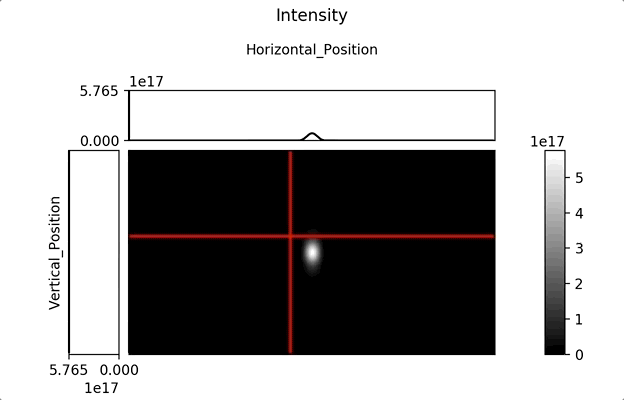
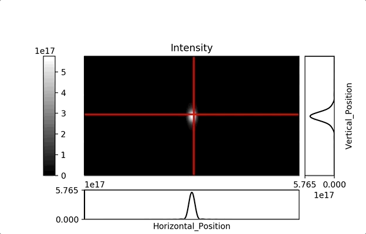

.. image:: https://travis-ci.com/kalebswartz7/SRW-parser.svg?branch=master
    :target: https://travis-ci.com/kalebswartz7/SRW-parser
===================
SRW-parser
===================

Reads in a data file and vizualizes data with image along with interactive horizontal and vertical cuts 

Installation:
-------------
Lightweight installation with only data parsing capabilities - 
::

    pip install SRW-parser
Full installation with graphing capabilities - 
:: 

    pip install "SRW-parser[complete]"

Features:
--------

* Specify specific data file
::

    SRW-parser -d <file_name>
    
* Specify data to be graphed with an interactive plot showing horizontal and vertical cuts 
::

    SRW-parser -d <file_name> -g
    
* Specify title of graph 
::

    SRW-parser -d <file_name> -g -t <title>
    
* Specify location of vertical cut
::

    SRW-parser -d <file_name> -g -vp <right or left>
 
* Specify location of horizontal cut
::

    SRW-parser -d <file_name> -g -vp <top or bottom>
    
* Specify vertical axis label 
::

    SRW-parser -d <file_name> -g -vl <label>
    
* Specify horizontal axis label
::

    SRW-parser -d <file_name> -g -hl <label>
    
* Specify extent lables
::

    SRW-parser -d <file_name> -g -e <horiz_initial, vert_initial, horiz_final, vert_final>
    
Examples:
--------

    
Credits:
-------

This package was created with Cookiecutter_ and the `audreyr/cookiecutter-pypackage`_ project template.

.. _Cookiecutter: https://github.com/audreyr/cookiecutter
.. _`audreyr/cookiecutter-pypackage`: https://github.com/audreyr/cookiecutter-pypackage
